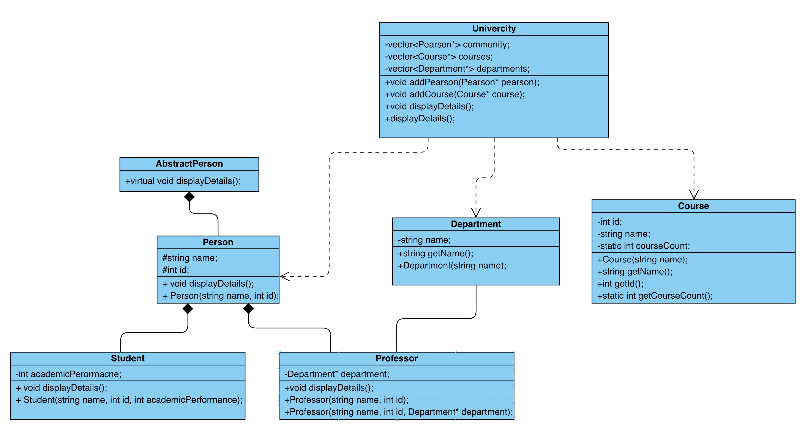

# Systém řízení univerzity

Tento projekt má program univerzitního systému řízení. Cílem systému je ukládat data týkající se studentů, profesorů, kurzů a kateder v rámci univerzity.

Systém umí přidávat nové studenty, profesory, kurzy a katedry a zobrazovat o nich informace.

## Spuštění kodu

### Pro snadnou kompilaci projektu jsem vytvořil Makefile, a proto pro kompilací stačí nápsat pouze
```
make
```
### a pro spuštění 
```
./main
```

##  UML Class diagram

